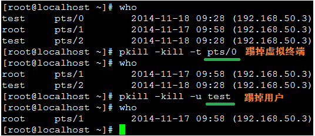

# Linux 命令


## iproute2


### 简介

Linux 中 iproute2 旨在取代 net-tools，功能强大，能轻松地执行一些网络管理任务。


### 常用命令

| 选项      |                             作用                             |
| --------- | :----------------------------------------------------------: |
| link      | 网络设备配置命令，可以开启/禁用某个网络设备，改变mtu及mac地址等。 |
| addr      | 用于管理某个网络设备的协议有关的地址，与ip link 类似，不过增加了协议有关的管理（例如：增加IP） |
| addrlabel | IPV6的地址标签，主要用于FRC3484中描述的IPV6地址的选择。RFC3484主要介绍了两个算法，用于IPV6地址的选择策略。 |
| rule      |                   管理路由，添加与删除等。                   |
| neigh     |       用于neighbor/ARP表的管理。如显示，插入，删除等。       |
| tunnel    | 隧道配置，隧道的作用是将数据封装成IP包然后在互联网上将包发出。 |
| maddr     |                         多播地址管理                         |
| mroute    |                         多播路由管理                         |
| monitor   |         状态监控，如可以支持监控IP地址何路由的状态。         |
| xfrm      | 设置xfrm。xfrm是一个IP框架，可以转换数据报的格式，如用某个算法对数据包进行加密。 |
|           |                                                              |


#### 设置 IP

```shell
#添加IP地址
ip addr add 192.168.17.30/24 dev eth0 
ip addr del 192.168.19.30/24 dev eth0
```

注意 IP 地址是CIDR（无类别域间路由选择，有时也被称作“超网络”。是一种分派和指定网络地址的方法。）格式 用于显示所用的子网掩码。


#### 路由查询

路由表说明：

默认情况下，系统有三个路由表：

**local**: 路由表local包含本机路由及广播信息。例如，在本机上执行ssh 127.0.0.1时，就会参考这份路由表的内容。在正常情况下，只要配置好网卡的网络设置，就会自动生成local路由表的内容，不用我们关注。

**main**：使用ip r 看到的路由表就是main的内容了。Linux系统在默认情况下使用这份路由表的内容来传输数据包。因此，排查问题主要是看此表。

**default**： 最后是default 表，这个路由表在默认情况下内容为空，一般不使用。

```shell
ip r
ip route show
ip route show table main
ip route get 192.168.12.120
```

#### 添加路由

```shell
ip route add default via 192.168.1.1
ip route add 192.168.2.0/24 via 192.168.2.1 table main
#查看当前的RPDB
ip rule show

ip route add from 192.168.3.0/24 table 10
```


## sed


# Linux 常用操作


## mount

```shell
#命令格式：
mount [-t vfstype] [-o options] device dir
#-t :指定文件系统的类型，通常不必指定，mount 会自动选择正确的类型。
#光盘或光盘镜像：iso9660 
#DOS fat16文件系统：msdos 
#Windows 9x fat32文件系统：vfat 
#Windows NT ntfs文件系统：ntfs 
#Mount Windows文件网络共享：smbfs 
#UNIX(LINUX) 文件网络共享：nfs

#-o options 主要用来描述设备或档案的挂接方式。
#loop：用来把一个文件当成硬盘分区挂接上系统 
#ro：采用只读方式挂接设备 
#rw：采用读写方式挂接设备 
#iocharset：指定访问文件系统所用字符集

mount -t nfs -o vers=3 10.10.10.10:/wangyijun_dev_01 /storage
```


## 查看踢出登录用户：

执行who命令，查看有哪些用户已登录到当前主机：

执行pkill命令，强制用户下线

pkill [-SIGNAL] [-u 用户名] [-t 虚拟终端名]

