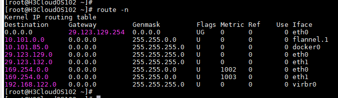

# 网络基本概念

## CIDR

Classless Inter-Domain Routing

CIDR主要是一个按位的、基于前缀的，用于解释IP地址的标准。

无类别域间路由是一个用于给用户分配 IP 地址以及在互联网上有效地地址路由 IP 数据包的对 IP 地址进行归类的方法。

一个 IP 地址包含两个部分：标识网络的前缀和紧接着的在这个网络内的主机地址。

在之前的分类网络中，[IP地址](https://baike.baidu.com/item/IP地址)的分配把IP地址的32位按每8位为一段分开。这使得前缀必须为8，16或者24位。因此，可分配的最小的地址块有256（24位前缀，8位主机地址，28=256）个地址，而这对大多数企业来说太少了。大一点的地址块包含65536（16位前缀，16位主机，216=65536）个地址，而这对大公司来说都太多了。这导致不能充分使用IP地址和在路由上的不便，因为大量的需要单独路由的小型网络（C类网络）因在地域上分得很开而很难进行聚合路由，于是给路由设备增加了很多负担。

无类别域间路由是基于可变长子网掩码（[VLSM](https://baike.baidu.com/item/VLSM))来进行任意长度的前缀的分配的。在RFC 950（1985）中有关于可变长子网掩码的说明。CIDR包括：指定任意长度的前缀的可变长子网掩码技术。遵从CIDR规则的地址有一个后缀说明前缀的位数，例如 192.168.0.0/16。这使得对日益缺乏的IPv4地址的使用更加有效。将多个连续的前缀聚合成超网,以及，在互联网中，只要有可能，就显示为一个聚合的网络，因此在总体上可以减少路由表的表项数目。聚合使得互联网的路由表不用分为多级，又用VLSM reverses the process of "subnetting a subnet" 。 根据机构的实际需要和短期预期需要而不是分类网络中所限定的过大或过小的地址块来管理IP地址的分配的过程。 因为在[IPv6](https://baike.baidu.com/item/IPv6)中也使用了[IPv4](https://baike.baidu.com/item/IPv4)的用后缀指示前缀长度的CIDR，所以IPv4中的分类在IPv6中已不再使用 。

## 单播、多播、组播

# 路由基础

## 基本概念

**路由**：数据包转发的过程。

**路由器**：能将数据包转发到正确的目的地，并在转发过程中选择最佳路径的设备。

**路由表**：在路由器中维护的路由条目，路由器根据路由表做路径的选择。

**直连路由**：当在路由器上配置了接口的IP地址，并且接口状态为up的时候，路由表中就会出现直连路由项。

**静态路由**：由管理员手工配置的，是单向的。

**默认路由**：当路由器在路由表中找不到目标网络的路由条目时，路由器把请求转发到默认路由接口。

Linux 路由表字段

| Destination | 目标网络或目标主机。Destination 为 default（0.0.0.0）时，表示这个是默认网关，所有数据都发到这个网关（这里是 10.139.128.1） |
| ----------- | ------------------------------------------------------------ |
| Gateway     | 网关地址，`0.0.0.0` 表示当前记录对应的 Destination 跟本机在同一个网段，通信时不需要经过网关（同一个局域网内2台主机通信不需要经过网关） |
| Genmask     | Destination 字段的网络掩码，Destination 是主机时需要设置为 `255.255.255.255`，是默认路由时会设置为 `0.0.0.0` |
| Flags       | 标志U - Up表示有效G - Gateway表示连接路由，若无这个字段表示直连目的地址H - Host表示目标是具体主机，而不是网段R 恢复动态路由产生的表项D 由路由的后台程序动态地安装M 由路由的后台程序修改! 拒绝路由 |
| Metric      | 路由距离，到达指定网络所需的中转数，是大型局域网和广域网设置所必需的 （不在Linux内核中使用。） |
| Ref         | 路由项引用次数 （不在Linux内核中使用。）                     |
| Use         | 此路由项被路由软件查找的次数                                 |
| Iface       | 网卡名字，例如 `eth0；要去往这个网段需要使用哪一个网络接口。也就是eth0这张网卡` |

